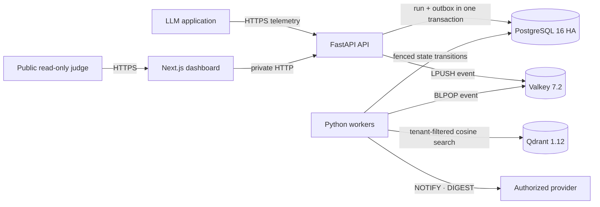

# DriftGuard

### When an LLM returns `200 OK`, how do you know its answer still means the right thing?

DriftGuard is a live semantic-reliability monitor for production LLM systems. It compares observed answers with versioned gold baselines, measures semantic distance, and turns meaningful deviations into durable operational incidents.

[**Open the live Zerops deployment**](https://dashboard-141-3000.sea1.zerops.app) · [Technical report](docs/TECHNICAL_REPORT.md) · [Load-test report](docs/LOAD_TEST_REPORT.md)

[](https://dashboard-141-3000.sea1.zerops.app)
[](https://github.com/Shoryamishra61/DriftGuard/actions/workflows/ci.yml)
[](https://github.com/Shoryamishra61/DriftGuard/actions/workflows/release.yml)
[](https://www.python.org/)
[](https://nextjs.org/)

> **Judge access:** no username or password is required. The public deployment is a server-enforced read-only view. It exposes live evidence and the guided tour while rejecting rule changes and telemetry writes. Administrative credentials remain private.

## Abstract

Availability is not semantic correctness. A language-model endpoint may remain responsive while model changes, retrieval failures, or prompt regressions alter the meaning of its answers. DriftGuard tests the proposition that semantic reliability should be observable like infrastructure reliability: continuously, tenant by tenant, and with auditable failure handling.

The system accepts production telemetry through FastAPI, atomically records each run and its outbox event in PostgreSQL, and returns before embedding work begins. Valkey carries the asynchronous task. Python workers encode text with a revision-pinned 384-dimensional MiniLM model and query project-scoped Qdrant baselines using cosine distance. Threshold breaches become `NOTIFY`, consolidated `DIGEST`, or `MUTE` incidents. A Next.js control plane presents semantic trends, vector topology, incident evidence, routing policy, and the health of the system observing the model.

## Research question

**Can semantic degradation be detected continuously without coupling expensive vector evaluation to the latency or durability of the production request path?**

DriftGuard separates two responsibilities:

1. **Admission:** validate, authenticate, and durably accept telemetry.
2. **Evaluation:** embed, compare, classify, persist, and route asynchronously.

This separation makes the reliability claim testable. PostgreSQL remains the source of truth; Valkey accelerates work but does not own it; Qdrant owns vector retrieval but does not decide relational state.

## System design



| Zerops service | Responsibility | Exposure |
| --- | --- | --- |
| `dashboard` | Next.js research console and guided judge tour | Public, read-only |
| `api` | FastAPI admission, analytics, diagnostics, and outbox dispatch | Public API |
| `worker` | Embedding, vector search, evaluation, retention, and delivery | Private |
| `db` | PostgreSQL 16 HA authoritative state | Private |
| `cache` | Valkey queue, rate limits, heartbeats, receipts, and caches | Private |
| `qdrant` | Versioned baseline and evaluation vectors | Private |

Zerops is part of the system rather than a final hosting step. `zerops.yaml` defines independent builds, runtime dependencies, private service discovery, build caches, startup preparation, autoscaling, liveness, and readiness. Only the dashboard and API receive public subdomains; internal communication uses plain HTTP over the private Zerops network.

## What is technically distinct

- **Transactional admission.** A run and its outbox event commit in one PostgreSQL transaction before queue publication.
- **Cross-store fencing.** Per-run PostgreSQL advisory ownership spans embedding, Qdrant mutation, and evaluation persistence, preventing duplicate consumers from diverging.
- **Versioned semantic reference.** Searches require project, point type, active baseline set, and immutable model revision.
- **Truthful notification state.** Delivery leases carry UUID fencing tokens; `notified_at` is written only after confirmed delivery.
- **Self-observation.** Infrastructure Pulse measures PostgreSQL, Valkey, Qdrant, and worker health beside model-quality signals.
- **Bounded data lifecycle.** Automated 30-day redaction, 90-day relational/vector expiry, seven-day outbox cleanup, and project/date legal holds run under a cluster-wide lock.

## Guided evaluation

Open the [live dashboard](https://dashboard-141-3000.sea1.zerops.app). The first visit starts a nine-step tour that:

1. traces admission from the API to the transactional outbox;
2. explains the semantic and end-to-end measurements;
3. inspects live PostgreSQL, Valkey, Qdrant, and worker health;
4. visualizes baseline and evaluation clusters without returning raw vectors to the browser;
5. verifies a persisted drift incident, its nearest baseline, and its routing outcome.

The public tour reads real deployment state. It does not create rules, submit telemetry, or contact a notification provider. This keeps the judging surface reproducible and safe to share.

## Evaluation evidence

The deployed system was verified on 9 August 2026 with six Zerops services reporting `ACTIVE`, 50 versioned baselines, a live evaluation matched in Qdrant, a durable suppressed incident, and an empty final queue.

The final deployment was also offered **500 requests/second for 60 seconds**. It accepted 24,209 of 30,000 requests and completed 115.259 requests/second; application p95 admission latency was 906.720 ms. The experiment therefore rejects—not confirms—the original 500-RPS and sub-5-ms targets. Full method, errors, percentiles, and recovery evidence are published in the [load-test report](docs/LOAD_TEST_REPORT.md).

This distinction matters: DriftGuard is a working challenge deployment, not a claim of enterprise-scale certification.

## Reproducibility

Requirements: Python 3.12, Node.js 22, PostgreSQL 16, Valkey 7.2, and Qdrant 1.12.

```sh
python -m pip install -r requirements-dev.txt
npm ci
python -m ruff check .
python -m pytest -q
npm run lint
npm run build
```

## Releases and container packages

Versioned deployments are published as three Linux/AMD64 images in GitHub Container Registry:

- `ghcr.io/shoryamishra61/driftguard-dashboard`
- `ghcr.io/shoryamishra61/driftguard-api`
- `ghcr.io/shoryamishra61/driftguard-worker`

Each `vMAJOR.MINOR.PATCH` tag must match the version in `package.json`. The release workflow reruns the complete Python and dashboard verification suites, publishes semver-tagged images with SBOM and build-provenance attestations, and only then creates the GitHub release. For example:

```bash
git tag -a v1.0.0 -m "DriftGuard v1.0.0"
git push origin v1.0.0
docker pull ghcr.io/shoryamishra61/driftguard-api:1.0.0
```

The API container starts the web service; run `alembic upgrade head` as a release task before serving a new schema version. Runtime credentials and dependency endpoints remain environment-only and are never baked into an image.

To create a new Zerops project:

```sh
zcli login YOUR_ZEROPS_TOKEN
zcli project project-import zerops-project-import.yaml
```

The import manifest provisions all six services and generated secrets. The API applies migrations and idempotently provisions the dashboard tenant; workers seed and activate `data/baselines/competition-v1.jsonl` before readiness.

## Security and responsible disclosure

The public dashboard is intentionally read-only. Administrative API access requires both a tenant API key and a separate admin token. Project keys are stored as SHA-256 digests; webhook destinations reject unsafe addresses and redirects; sensitive runtime values remain Zerops secrets. Never place dashboard passwords, API keys, provider URLs, or Zerops tokens in this repository.

OpenAI Codex assisted with implementation, debugging, tests, security review, deployment operations, and documentation. **Shorya Mishra** defined the problem and competition goal, directed the architecture and trade-offs, controlled credentials and deployment, reviewed the code, and is responsible for the submitted system.

## Further reading

- [Technical report](docs/TECHNICAL_REPORT.md) — requirements, algorithms, failure boundaries, and limitations
- [Load-test report](docs/LOAD_TEST_REPORT.md) — method and raw acceptance conclusions
- [Submission package](docs/COMPETITION_SUBMISSION.md) — exact form copy and eligibility evidence
- [Social launch package](docs/SOCIAL_POST.md) — post, thread, and video sequence
- [Security policy](SECURITY.md) — vulnerability reporting and operational boundaries

## License

[MIT](LICENSE)
