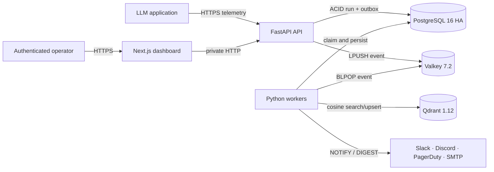

# DriftGuard

> Real-time semantic drift detection and durable reliability monitoring for production LLM systems, deployed on Zerops.

[](https://dashboard-141-3000.sea1.zerops.app)
[](https://github.com/Shoryamishra61/DriftGuard/actions/workflows/ci.yml)
[](https://www.python.org/)
[](https://nextjs.org/)

**Live dashboard:** [dashboard-141-3000.sea1.zerops.app](https://dashboard-141-3000.sea1.zerops.app)<br>
**Live API:** [api-141-8000.sea1.zerops.app/status](https://api-141-8000.sea1.zerops.app/status)<br>
**Source:** [github.com/Shoryamishra61/DriftGuard](https://github.com/Shoryamishra61/DriftGuard)

The dashboard is intentionally authenticated because it exposes production prompts, outputs, baselines, incidents, and routing controls. Demo credentials belong in the private challenge submission, never in this repository.

## Abstract

Production LLM endpoints can continue returning successful HTTP responses while the meaning and reliability of their answers deteriorate. DriftGuard turns that silent failure mode into an observable operational signal. It accepts authenticated telemetry, commits each run and queue event atomically, computes a pinned 384-dimensional embedding asynchronously, compares it with a versioned tenant baseline in Qdrant, and routes threshold breaches through durable `NOTIFY`, daily `DIGEST`, or `MUTE` policies.

The system is deployed as six decoupled Zerops services. Public ingress is limited to the dashboard and API. PostgreSQL, Valkey, Qdrant, and the worker remain on the private Zerops network.

## Why it matters

Traditional uptime monitoring answers “did the endpoint respond?” DriftGuard answers a harder question: “did the answer remain semantically aligned with what production considers acceptable?”

- Detects meaning-level degradation even when upstream status is `200 OK`.
- Preserves an immutable, project-scoped audit trail.
- Separates ingestion latency from heavier model evaluation.
- Makes routing outcomes honest: `notified_at` is written only after delivery.
- Exposes infrastructure health beside model-quality signals.

## Architecture



| Service | Exposure | Zerops role |
| --- | --- | --- |
| `dashboard` | Public | Next.js telemetry, alert, vector-projection, and Infrastructure Pulse UI |
| `api` | Public | FastAPI ingestion, administration, diagnostics, and transactional outbox dispatcher |
| `worker` | Private | MiniLM inference, vector search, drift evaluation, and durable delivery |
| `db` | Private | PostgreSQL 16 HA authoritative state |
| `cache` | Private | Valkey queue, rate limits, heartbeat, receipts, and embedding cache |
| `qdrant` | Private | Project-filtered baseline and evaluation vectors |

Internal services use Zerops private hostnames such as `http://api:8000` and `http://qdrant:6333`. Managed data-store ports are never exposed publicly.

## Reliability model

1. `POST /api/v1/logs` validates the project and bounded request body.
2. One PostgreSQL transaction inserts both `telemetry_runs` and `telemetry_outbox`.
3. The API returns `202 Accepted` only after that transaction commits.
4. The outbox dispatcher publishes `{event_id, run_id}` to Valkey.
5. A worker holds per-run PostgreSQL advisory ownership across embedding, Qdrant mutation, and relational persistence.
6. Delivery rows use expiring leases plus UUID fencing tokens; stale workers cannot finalize reclaimed alerts.
7. External delivery is at least once. Provider idempotency keys and stable receipts reduce—but cannot mathematically eliminate—the external-`2xx` crash window.

Startup connections use an initial attempt plus five exponential retries at 2, 4, 8, 16, and 32 seconds. Qdrant calls use a concurrency-safe closed/open/half-open circuit breaker. Readiness verifies migrations, credentials, dependencies, the pinned model, vector dimension, and worker heartbeat.

## Semantic evaluation

- Encoder: `sentence-transformers/all-MiniLM-L6-v2`
- Immutable revision: `1110a243fdf4706b3f48f1d95db1a4f5529b4d41`
- Vector dimension: 384
- Distance: cosine
- Isolation filters: `project_id`, `point_type`, `baseline_set`, and model revision
- Baseline lifecycle: immutable versioned sets with deterministic content manifests

The reference Zerops deployment automatically seeds `data/baselines/competition-v1.jsonl`. Two starting worker containers coordinate through a Valkey ownership lock; the winner seeds and activates the set, while the other waits and verifies the identical manifest. A changed corpus requires a new version name.

## Security boundaries

- Project API keys are stored only as SHA-256 digests.
- Dashboard administration requires both a project key and an independent admin token.
- The browser never receives the admin token, notification credentials, or raw 384-dimensional vectors.
- Basic authentication, same-origin mutation checks, and a server-side proxy protect the dashboard.
- Webhooks reject redirects, credentials in URLs, unsafe ports, and non-public IP classes after DNS resolution.
- Slack, Discord, and PagerDuty destinations use strict native URL/envelope validation.
- Rotatable credentials are Zerops secret variables; plaintext secrets are absent from Git.

## Live verification

Verified on 9 August 2026 against the deployed Zerops project:

| Gate | Result |
| --- | --- |
| Six services | `dashboard`, `api`, `worker`, `db`, `cache`, `qdrant` all `ACTIVE` |
| Dashboard liveness | HTTP `200` |
| Authenticated dashboard | HTTP `200` |
| Dashboard/API credential pair | HTTP `204` |
| API status | HTTP `200`; PostgreSQL, Valkey, and Qdrant healthy |
| Infrastructure Pulse | Healthy PostgreSQL, Valkey, Qdrant, and worker |
| Live semantic path | 50 active baselines, one evaluated run, matched baseline, drift `0.75923121` |
| Live durable routing | MUTE result persisted as `SNOOZED / SUPPRESSED`; queue returned to zero |
| Live Qdrant state | 52 points: 50 baselines, one manifest, one evaluation |
| Managed-store exposure | Private only |
| Source visibility | Public GitHub repository |
| Python verification | 189 tests passed; 4 real-PostgreSQL tests opt in locally |
| Frontend verification | ESLint and optimized Next.js production build passed |

The project does **not** claim the original stretch target of sub-5 ms public HTTP admission or sustained 500 requests per second. Those claims require a controlled load test on the final Zerops sizes. The technical report separates measured results from unverified capacity targets.

## Deploy on Zerops

The import manifest provisions all six services, generated secrets, private references, autoscaling, public routes, and one-time Git builds:

```sh
zcli login YOUR_ZEROPS_TOKEN
zcli project project-import zerops-project-import.yaml
```

For an existing empty project, import only the `services` block, then deploy the three runtime setups:

```sh
zcli push api --project-id PROJECT_ID --setup api --workspace-state clean
zcli push worker --project-id PROJECT_ID --setup worker --workspace-state clean
zcli push dashboard --project-id PROJECT_ID --setup dashboard --workspace-state clean
```

The API migrates PostgreSQL and idempotently provisions the `Zerops Dashboard` tenant. Workers idempotently seed and activate the competition baseline before accepting jobs. The dashboard readiness gate validates its complete credential pair against the API.

## API surface

| Method and path | Purpose |
| --- | --- |
| `POST /api/v1/logs` | Authenticated telemetry ingestion |
| `GET /api/v1/metrics/trends` | Windowed drift and latency aggregates |
| `GET /api/v1/alerts` | Searchable tenant incident evidence |
| `GET/POST /api/v1/alert-rules` | List and create routing policy |
| `PUT /api/v1/alert-rules/{id}` | Reconcile routing policy updates |
| `GET /api/v1/vectors/projection` | Bounded 2D projection without browser-visible raw vectors |
| `GET /api/v1/diagnostics/pulse` | Dependency latency, queue depth, vector count, and worker heartbeat |
| `GET /api/v1/dashboard/session` | Validate dashboard project/admin credentials |

## Local verification

Use Python 3.12, Node.js 22, PostgreSQL 16, Valkey 7.2, and Qdrant 1.12.

```sh
python -m pip install -r requirements-dev.txt
npm ci
python -m ruff check .
python -m pytest -q
npm run lint
npm run build
npm audit --omit=dev --audit-level=high
```

CI additionally starts PostgreSQL 16 and enables the opt-in database integration suite through `DRIFTGUARD_TEST_DATABASE_URL`.

## Documentation

- [Technical report](docs/TECHNICAL_REPORT.md)
- [Competition submission checklist](docs/COMPETITION_SUBMISSION.md)
- [Social post and demo script](docs/SOCIAL_POST.md)
- [Security policy](SECURITY.md)

## AI-use disclosure

OpenAI Codex was used for implementation assistance, debugging, testing, security review, deployment support, and documentation. Shorya Mishra defined the product requirements and competition goal, directed architectural and release decisions, supplied and controlled platform credentials, reviewed the resulting system, and owns the submission. This disclosure is intentionally explicit to satisfy the challenge AI-use policy.

## License

[MIT](LICENSE)
